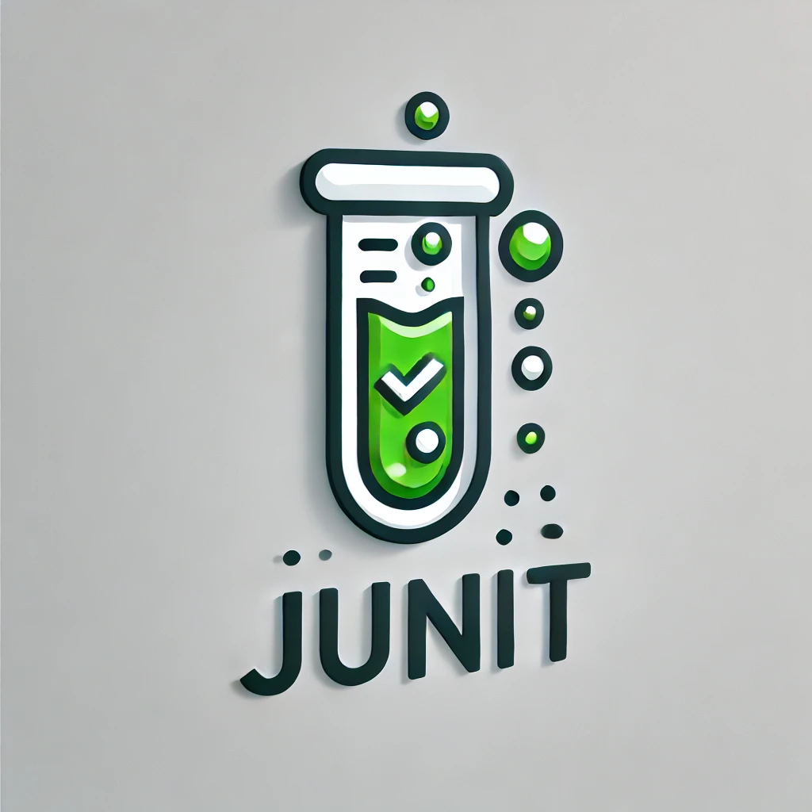

# Week12CodingProject
<div align="center">

  
  <h1>Backend Programming Unit Testing Project</h1>
  
  <p>
    Junit Testing a Java Application 
  </p>
  
</div>

<!-- TechStack -->
### :space_invader: Tech Stack

<details>
  <summary>Java</summary>
  <ul>
    <li><a href="https://www.java.com/en/">Java</a></li>
  </ul>
</details>

<details>
  <summary>Maven</summary>
  <ul>
    <li><a href="https://maven.apache.org/">Maven</a></li>
  </ul>
</details>

<details>
<summary>Mockito</summary>
  <ul>
    <li><a href="https://site.mockito.org/">Mockito</a></li>
  </ul>
</details>
<!-- Run Locally -->

### :running: Run Locally

Clone the project

```bash
  git clone https://github.com/ldavis57/Week12CodingProject
```
🤝 Contact
Lana Davis - davis.lanac@gmail.com

Project Link: https://github.com/ldavis57/Week12CodingProject

<!-- Acknowledgments -->
## :gem: Acknowledgements
 - [Shields.io](https://shields.io/)
 - [Awesome README](https://github.com/matiassingers/awesome-readme)
 - [Emoji Cheat Sheet](https://github.com/ikatyang/emoji-cheat-sheet/blob/master/README.md#travel--places)
 - [Readme Template](https://github.com/othneildrew/Best-README-Template)

